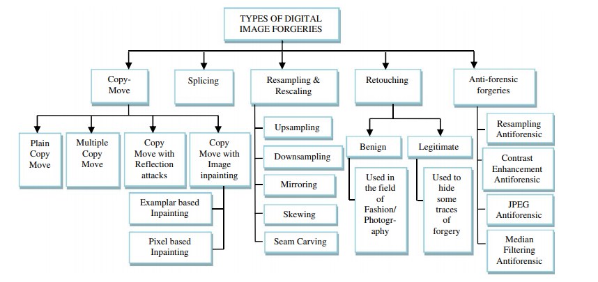
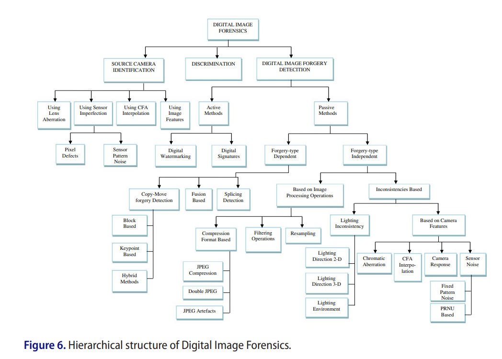

28th october 2019

### Types of Forgery

forensics_methods.png

### Hierchy of Forgery Detection Methods

### Repositories that are working :
- Copy-Move

- - copy-move/copy_move_matlab

- - - - Copy-move forgery detection and localization by means of robust clustering with J-Linkage

- - - - Detection of Copy-Move Forgery in Digital Images

- - copy-move/image-copy-move-detection/copy_move_detection_python_2

- - - - main_CLI.py working

- Matlab Forensics

- - JPEG Quantization Estimation

- - - Demo_estimate_quantization_step.m 

- - - Demo_identify_decompressed_bitmap.m

- - Image Forgery Localization via Fine-Grained Analysis of CFA 

- - - demo_Piva.m

- - Exposing digital forgeries from JPEG ghosts

- - - demo_2.m

- - Kurtosis - Exposing Region Splicing Forgeries with Blind Local Noise Estimation

- - - demoGlobalNoiEst.m

- - - demoLocalNoiEst.m
